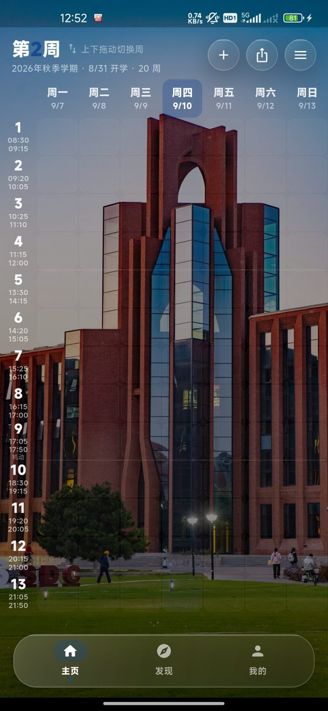

# 果小课 · Schedule-For-UCAS

> 一款为**中国科学院大学研究生**设计的课表 App。在 App 内登录 SEP，即可自动抓取选课系统「个人课表」并一键导入本学期全部课程；
> 上课时间、地点、周次通过选课系统的公开课程信息接口自动补全。所有数据只保存在本机。
> 使用 Flutter / Dart 开发，基于开源项目 [Schedule-For-WHU](https://github.com/PriAssassin141/Schedule-For-WHU) 改造。

<p align="left">
  
  
  
  
</p>

<p align="left">
  
</p>

---

## ✨ 功能特性

### 课表

- **周一~周日同屏显示**：一天 13 节 × 一周 7 天全部在一屏内呈现，行高按屏幕高度自适应
- **上下拖动翻页切换周次**：跟手拖动、松手自动翻页或回弹；非本周时显示「回到本周」
- 上午 / 下午 / 晚上之间有分隔线，第 9 节标注「机动」；法定假日在表头标红
- 点击「第 N 周」弹出周次网格直接跳转；点击课程卡片编辑；长按可换色 / 删除
- 课程重叠时自动分栏显示

### 从选课系统导入

- **登录选课系统自动导入**：在 App 内输入 SEP 账号、密码和验证码，自动登录并抓取选课系统「个人课表」，联网补全时间、地点、周次
- **导入个人课表网页**：也可把「个人课表」页另存为网页（或 F12 导出 HAR）后在 App 中选择文件
- **课表口令**：把本学期课程编号打包成一行文字，同学粘贴即可导入同一份课表；也可直接粘贴 `coursetime` 链接
- **离线兜底**：没有网络时按网格位置导入（周次按全周），联网后点「刷新课表」补齐
- **刷新课表**：课程调整后一键从选课系统重新获取，保留你自定义的颜色与备注
- 慕课类课程（不在课表网格内）自动提示，可把截止日期一键加入考试倒计时
- 导入前逐门预览、勾选、修正；支持「追加导入」或「清空本学期并导入」

### 学期管理

- 课程**按学期分开保存**，切换学期后主页只显示该学期课程
- 内置 2026-2027 学年秋、春两个学期；导入时按选课系统返回的开学日期**自动新建学期**，下一学年无需更新 App
- 可手动新建学期、修改开学日期与周数、删除学期

### 考试倒计时与教务入口

- 考试倒计时：名称、地点、日期、起止时间、备注；已结束考试自动折叠
- 发现页一键打开：学校校历、个人课表、SEP 门户、教室查询、考试安排、公开开课表

### 个性化（即时生效）

主题颜色（默认国科大蓝）、背景模糊、卡片透明、卡片背景模糊、液态玻璃、果冻效果、饱和度、折射、色散、背景图片、显示网格、个人姓名。

---

## ⏰ 国科大课程时间（13 节）

| 节次 | 时间 | 节次 | 时间 |
| --- | --- | --- | --- |
| 1 | 08:30~09:15 | 8 | 16:15~17:00 |
| 2 | 09:20~10:05 | 9 | 17:05~17:50（机动） |
| 3 | 10:25~11:10 | 10 | 18:30~19:15 |
| 4 | 11:15~12:00 | 11 | 19:20~20:05 |
| 5 | 13:30~14:15 | 12 | 20:15~21:00 |
| 6 | 14:20~15:05 | 13 | 21:05~21:50 |
| 7 | 15:25~16:10 | | |

来源：教务部《中国科学院大学课程时间节次表》（2025-07）。

---

## 📥 课表导入说明

### 方式一：登录选课系统自动导入（推荐）

1. 主页右上角菜单 → **导入课表** → **登录选课系统自动导入**
2. 输入 SEP 用户名（国科大邮箱）、密码和图形验证码，点击「登录并导入课表」
3. App 会像浏览器一样登录 `sep.ucas.ac.cn`（密码在本机用页面公钥 RSA 加密后提交，与网页登录完全一致），进入选课系统抓取「个人课表」，再向公开接口逐门获取时间地点，进入预览页核对后导入
4. 勾选「记住账号和密码」后，以后在主页菜单点「重新登录选课系统同步课表」即可一键更新（仍需输入验证码）

### 方式二：导入个人课表网页

电脑登录 SEP → 选课系统 → 学期课表，把 `https://xkgo.ucas.ac.cn:3000/course/personSchedule` 另存为 HTML（或 F12 导出 HAR），传到手机后在导入弹层选择「导入个人课表网页」。

### 方式三：粘贴课程链接 / 课表口令

- 在导入弹层选择「粘贴课程链接 / 课表口令」，粘贴同学分享的 `guoxiaoke:314787,314784,...`，或若干条 `https://xkcts.ucas.ac.cn:8443/course/coursetime/314787` 链接
- 分享自己的课表：主页分享按钮 → **复制课表口令**

### 高级：自制表格

支持 `docx` / `xlsx` 课表表格（表头含「星期一…」，首列为节次，单元格内「1-16周」+ 课程名 + 教师 + 地点），不推荐日常使用。

### 联网说明

- 登录导入时账号密码只发送给 `sep.ucas.ac.cn`；获取课程信息时仅向 `xkcts.ucas.ac.cn` 发送课程编号
- 不联网也可使用：手动添加课程，或离线导入网页（周次按全周）
- 若日后公开接口需要登录，App 会提示并自动改用离线网格数据

---

## 🧱 技术栈

| 用途 | 方案 |
| --- | --- |
| 语言 / 框架 | Flutter 3.44+ / Dart 3.12+（Material 3，深色玻璃质感） |
| 界面效果 | 自定义 `BackdropFilter` + 渐变 + `CustomPainter` 实现液态玻璃 |
| 本地存储 | `sqflite`（Android 使用系统 SQLite；Windows / Linux 使用 `sqflite_common_ffi`） |
| 选课系统对接 | `dio` + `cookie_jar` 模拟登录 SEP（`pointycastle` 做 RSA/PKCS#1 加密）；`dart:io HttpClient` 请求公开接口；`html` 解析个人课表页 |
| 密码存储 | `flutter_secure_storage`（AES/GCM 加密；密钥由 Android Keystore 包裹 / 存于 Windows 凭据管理器） |
| 其它 | `provider`、`file_picker`、`url_launcher`、`flutter_localizations`、`flutter_launcher_icons` |

### 选课系统接口位掩码

`GET https://xkcts.ucas.ac.cn:8443/course/coursetime/{id}.json`（无需登录）的每个 `courseTimeList` 元素：

- `courseTime >> 13` = 星期（1 = 周一 … 7 = 周日）
- `courseTime` 低 13 位第 k 位 = 第 k+1 节
- `courseWeek` 第 k 位 = 第 k+1 周
- `term.firstDay` = 学期第 1 周周一

解码实现见 `lib/services/ucas_bitmask.dart`，测试夹具为 `test/fixtures/ucas/` 下的真实响应。

---

## 📁 项目结构

```
lib/
├── main.dart                            # 入口：桌面 FFI 初始化、中文本地化、主题
├── db/app_database.dart                 # SQLite（v2：课程按学期隔离，含 v1 → v2 迁移）
├── models/
│   ├── course.dart / exam.dart / app_settings.dart
│   ├── semester.dart                    # 学期（按开学日期标识）、预置校历与法定假日
│   └── periods.dart                     # 国科大 13 节时刻表
├── services/
│   ├── ucas_bitmask.dart                # courseTime / courseWeek 位掩码解码
│   ├── ucas_person_schedule_parser.dart # 个人课表页 HTML / HAR 解析、课表口令
│   ├── ucas_sep_client.dart             # SEP 登录（RSA + 验证码）+ 选课系统个人课表抓取
│   ├── ucas_course_resolver.dart        # 公开接口在线补全（并发、重试、登录墙识别）
│   ├── secret_store.dart                # SEP 密码安全存储抽象（正式 / 内存两种实现）
│   ├── schedule_parser.dart             # 通用表格 → 课程
│   └── schedule_importer.dart           # docx / xlsx 高级导入
├── screens/
│   ├── root_shell.dart / home_screen.dart / discover_screen.dart / mine_screen.dart
│   ├── ucas_login_screen.dart           # SEP 登录页（验证码、记住账号）
│   ├── import_preview_screen.dart       # 导入入口、在线补全进度、预览
│   └── course_edit_screen.dart / exam_edit_screen.dart / personalization_screen.dart
├── state/app_state.dart                 # 全局状态：课程 / 考试 / 学期 / 设置
├── widgets/glass.dart / app_background.dart
├── utils/weeks.dart / links.dart / greeting.dart / routes.dart
└── theme/palette.dart                   # 国科大蓝主题色与课程配色盘
test/                                    # 77 个用例
├── fixtures/ucas/                       # 选课系统真实响应样例（公开数据 / 已脱敏）
integration_test/                        # 真机集成测试（安全存储、迁移、验证码联网）
```

---

## 🚀 快速开始

### 环境要求

- Flutter 3.44 或更高（`flutter doctor` 通过）
- Android 端：Android SDK
- Windows 桌面预览：Visual Studio 2022 生成工具（含 C++ 桌面开发），并在系统「设置 → 隐私和安全性 → 开发者选项」中打开「开发者模式」（插件构建需要符号链接权限）

### 运行与构建

```bash
flutter pub get
flutter test                                  # 运行全部单元 / 组件测试
flutter test integration_test -d <设备ID> --no-uninstall   # 真机验证密码安全存储与 SEP 验证码联网（不需要账号；不加 --no-uninstall 会在测完后卸载应用）
flutter run                                   # Android 真机 / 模拟器
flutter run -d windows                        # 桌面预览
flutter build apk --release --split-per-abi   # 产物 build/app/outputs/flutter-apk/app-arm64-v8a-release.apk
dart run flutter_launcher_icons               # 重新生成应用图标
```

> 日常使用请安装 **release** 包：debug 包运行在 JIT 模式下，启动明显更慢、翻页掉帧，且体积近 200 MB。

---

## 💾 数据与隐私

- 课程、考试、学期、个性化设置保存在本地 SQLite（`class_manager.db`），不上传
- 登录导入时，账号密码只发送给 SEP 平台；勾选「记住账号和密码」后，密码经 `flutter_secure_storage` 加密保存（Android Keystore / Windows 凭据管理器），不进入 SQLite，也不参与系统备份，可在登录页取消勾选清除
- 导入 / 刷新课表时仅向选课系统公开接口发送课程编号
- 登录失败时显示的调试信息已去除会话令牌，可安全用于反馈问题
- 壁纸会被复制到应用私有目录

---

## ⚠️ 已知限制

- 周数上限 20 周（国科大秋季学期），春季学期默认 18 周（含夏季 I / II 两周）
- 课程配色盘 10 色，超过 10 门后复用
- 慕课类课程（无课程编号、不在网格中）无法作为课程导入，只能加入倒计时
- 教师姓名选课系统接口未提供
- 仅支持 Android 与 Windows；未适配 iOS / macOS / Linux

---

## 🙏 致谢

- [Schedule-For-WHU](https://github.com/PriAssassin141/Schedule-For-WHU)（PriAssassin141，MIT）：本项目的界面、翻页课表与液态玻璃组件均来自该项目
- 「矿小助」（中国矿业大学翔工作室）：原项目设计参考；本项目的 SEP 模拟登录思路参考了其开源实现
- 应用图标使用中国科学院院徽；默认壁纸为雁栖湖校区主楼，图片来自国科大新闻网「光影国科大」第 141 期「果壳秋景」。版权均归中国科学院、中国科学院大学所有，本应用仅作学习用途
- 本项目的国科大适配代码在 Claude Code 辅助下完成

## 📄 开源协议

[MIT License](LICENSE)
